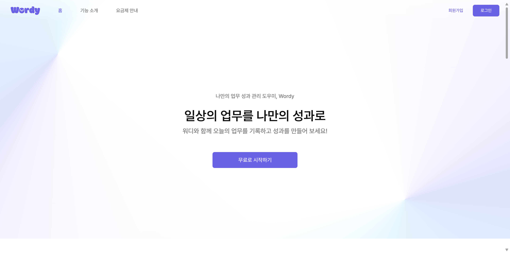
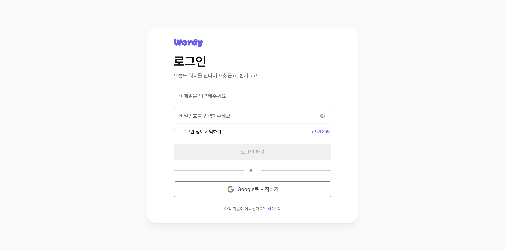
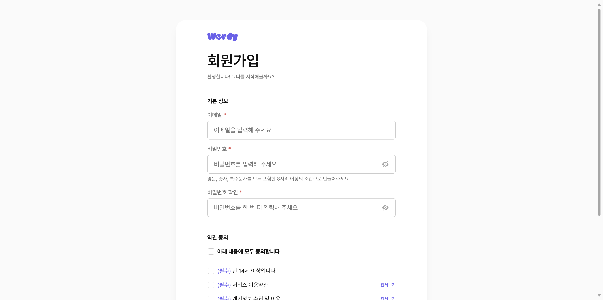
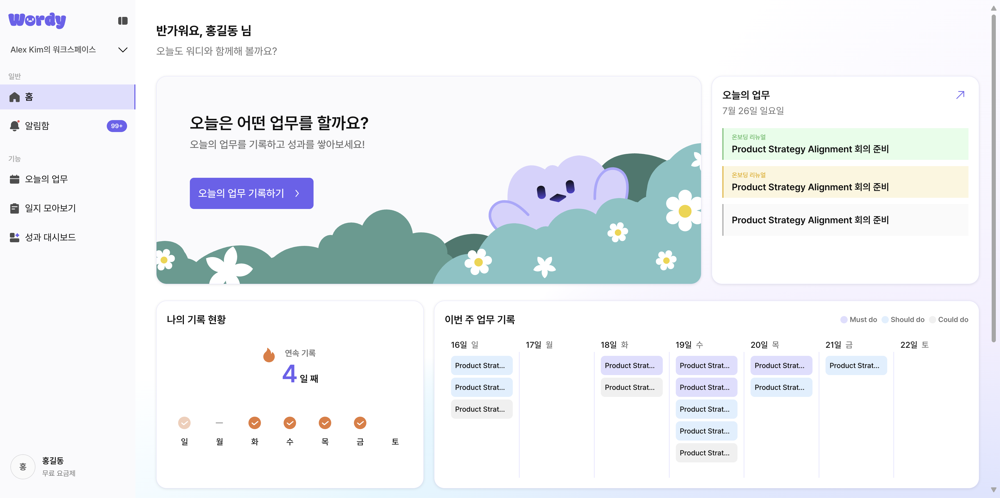
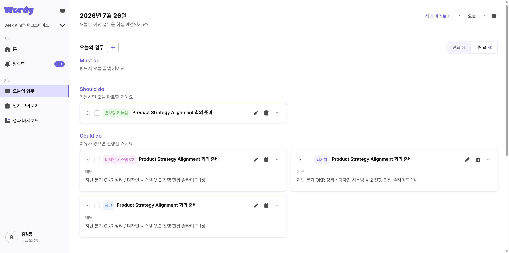
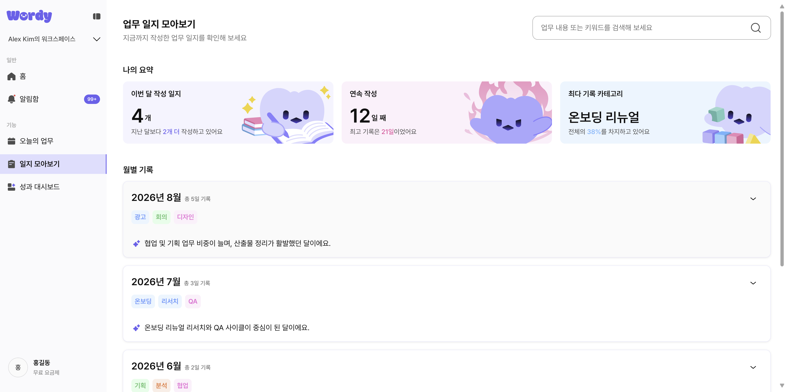
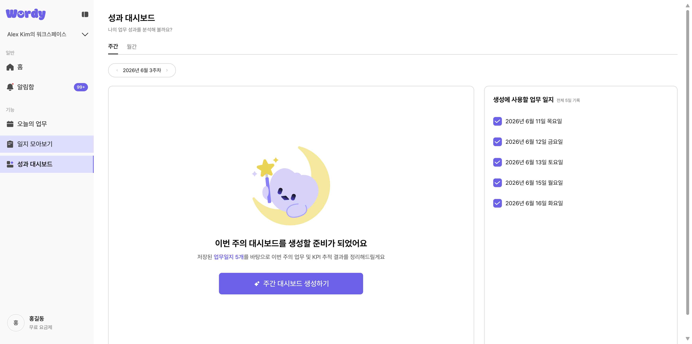

# Wordy FE

[](https://github.com/UMC-10th-Wordy/Wordy_FE/actions/workflows/ci.yml)

UMC 10th Wordy 프로젝트 프론트엔드

업무일지 작성, AI 성과 변환, 주간·월간 대시보드를 통해 개인 업무를 체계적으로 관리하는 웹 애플리케이션입니다.

**진행 기간**: 2026.07.01 ~ 2026.08.22

## 프로젝트 링크

- [배포 서비스](https://wordy-site.vercel.app/)
- [GitHub Repository (FE)](https://github.com/UMC-10th-Wordy/Wordy_FE)
- [GitHub Repository (BE)](https://github.com/UMC-10th-Wordy/Wordy_BE)

## 주요 기능

- 오늘의 업무를 등록하고 수정·삭제하거나 완료 상태로 관리
- 프로젝트 태그 생성·수정·삭제 및 업무별 태그 설정
- 업무 결과와 첨부 파일을 기록하고 AI 성과 변환 흐름 체험
- 월별 업무 일지 목록·상세·검색 및 휴지통 관리
- 주간·월간 성과 리포트와 회고·계획 작성
- 이메일 및 소셜 회원가입, 프로필 설정 화면 제공

> 비밀번호 찾기, 약관 전문보기, 이메일 인증 메일 재전송, 인증 문의하기 등 일부 보조 기능은 데모데이 이후 후속 작업으로 남아 있습니다. (해당 버튼 클릭 시 안내 토스트로 명시)

## 목차

- [기술 스택](#기술-스택)
- [시작하기](#시작하기)
- [환경 변수](#환경-변수)
- [스크립트](#스크립트)
- [테스트](#테스트)
- [팀원 및 역할 분담](#팀원-및-역할-분담)
- [폴더 구조](#폴더-구조)
  - [폴더/파일 네이밍 규칙](#폴더파일-네이밍-규칙)
- [화면 목록 및 플로우](#화면-목록-및-플로우)
- [구현 화면](#구현-화면)
- [협업 규칙](#협업-규칙)

## 기술 스택

- React 19 + TypeScript
- React Router
- TanStack Query
- zustand
- Vite 8
- Tailwind CSS v4
- Framer Motion
- class-variance-authority
- pdfjs-dist
- ESLint + Prettier
- Husky + Commitlint
- Vitest + Testing Library

> 전체 화면과 사용자 흐름은 실제 백엔드 API 연동까지 완료된 상태입니다. 도메인별로 TanStack Query 기반 데이터 페칭 구조와 응답 타입을 설계하고, 목업 함수를 실제 fetch 호출로 순차 교체하는 방식으로 진행했습니다.

## 시작하기

### 요구 사항

- Node.js 24 이상
- pnpm

### 설치 및 실행

```bash
git clone https://github.com/UMC-10th-Wordy/Wordy_FE.git
cd Wordy_FE

pnpm install

cp .env.example .env

pnpm dev
```

### 배포

- `main` 브랜치에 머지되면 Vercel이 GitHub 연동을 통해 프로덕션 배포를 자동으로 진행합니다.
- `feat` / `fix` 브랜치의 PR에는 Vercel이 프리뷰 배포 URL을 자동으로 생성합니다.

## 환경 변수

위 "설치 및 실행" 과정에서 생성한 `.env` 파일에 아래 변수를 설정합니다.

| 변수                | 설명                 | 기본 예시               |
| ------------------- | -------------------- | ----------------------- |
| `VITE_API_BASE_URL` | 백엔드 API 기본 주소 | `http://localhost:8080` |

## 스크립트

| 명령어               | 설명                    |
| -------------------- | ----------------------- |
| `pnpm dev`           | 개발 서버 실행          |
| `pnpm build`         | 프로덕션 빌드           |
| `pnpm check`         | 포맷팅 + 린트 자동 수정 |
| `pnpm lint`          | 린트 검사               |
| `pnpm format`        | 포맷팅                  |
| `pnpm type-check`    | 타입 체크               |
| `pnpm preview`       | 빌드 결과 로컬 미리보기 |
| `pnpm test`          | 테스트 실행             |
| `pnpm test:watch`    | 테스트 watch 모드       |
| `pnpm test:coverage` | 테스트 커버리지 측정    |

## 테스트

Vitest + React Testing Library로 유닛 테스트를 작성합니다.

- 공통 셋업은 `src/test/setup.ts`에 있습니다.
- 테스트 파일은 대상 파일과 같은 위치에 `*.test.ts(x)`로 둡니다. (예: `src/lib/httpClient.test.ts`)
- 실행 환경은 `.nvmrc` 기준 Node 24입니다. jsdom이 요구하는 Node 내부 API 때문에 Node 20 이하에서는 테스트가 정상 동작하지 않습니다.

```bash
pnpm test
```

## 팀원 및 역할 분담

| 이름        | UI 담당                                       | API 담당                                           |
| ----------- | --------------------------------------------- | -------------------------------------------------- |
| 예원 (조이) | 공용 컴포넌트, 홈, 랜딩페이지, 태그 관리 모달 | Users, Home, Auth, Workspace, Trash, Notifications |
| 채연 (길동) | 업무일지 작성 (카드 · 체크리스트 · 드래그 등) | Tags, Tasks, Task Results                          |
| 보미 (보리) | 성과 미리보기, 일지 히스토리                  | Daily Entries, Performance                         |
| 서윤 (마리) | 로그인/회원가입, 대시보드 (주간 · 월간)       | Dashboard (주간·월간), DashboardDraft              |

> AI 도메인은 전채연·김보미·김서윤이 공동 담당했습니다.

## 폴더 구조

```
src/
├── api/             # API 호출
├── assets/          # 이미지, 폰트 등 정적 파일
├── components/
│   ├── common/      # 앱 전체 공용 컴포넌트 (조이 담당, 개별 생성 금지)
│   └── [page]/      # 페이지 전용 컴포넌트
├── constants/       # 여러 도메인에서 공유하는 상수
├── hooks/           # 커스텀 훅
├── lib/             # 외부 라이브러리 설정 (TanStack Query 등)
├── mocks/           # Mock 데이터
├── pages/           # 라우트 단위 페이지
├── router/          # 라우트 설정
├── store/           # 전역 상태 (zustand)
├── styles/          # 전역 스타일
├── test/            # 테스트 공통 셋업
├── types/           # TypeScript 타입 정의
└── utils/           # 유틸 함수
```

### 폴더/파일 네이밍 규칙

일반적으로 React + TypeScript 프로젝트에서 널리 쓰이는 방식을 따릅니다.

| 대상                                     | 규칙                                                                          | 예시                                                                 |
| ---------------------------------------- | ----------------------------------------------------------------------------- | -------------------------------------------------------------------- |
| 폴더 (여러 파일을 묶는 도메인/기능 단위) | kebab-case                                                                    | `diary-list/`, `diary-search/`, `sidebar/`                           |
| 폴더 (컴포넌트 1개를 감싸는 경우)        | PascalCase (컴포넌트명과 동일)                                                | `ConfirmDialog/ConfirmDialog.tsx`, `Scrollbar/Scrollbar.tsx`         |
| 컴포넌트 파일                            | PascalCase (컴포넌트명과 동일)                                                | `SidebarLayout.tsx`, `ProjectTag.tsx`                                |
| 페이지 파일 (`pages/`)                   | 라우트 1개당 파일 1개, 같은 도메인 페이지가 여러 개면 폴더로 묶고 아니면 flat | `DashboardPage.tsx`, `auth/LoginPage.tsx`, `diary/DiaryListPage.tsx` |
| API 파일 (fetch 함수 + queryKeys)        | camelCase 도메인명, `api/<domain>/`에 위치, 역할 접미사 없음                  | `api/user/user.ts`, `api/task/task.ts`                               |
| TanStack Query 훅 파일                   | `use<Domain>Queries` 형태, `hooks/`에 flat 배치                               | `useUserQueries.ts`, `useDailyEntryQueries.ts`                       |
| 타입 파일                                | camelCase 도메인명, 도메인 모델과 DTO를 한 파일에 병합                        | `user.ts`, `diaryDetail.ts`                                          |
| Mock 파일                                | 대상 도메인/API명 + `Mock` 접미사                                             | `taskApiMock.ts`, `homeMock.ts`                                      |

## 화면 목록 및 플로우

### 메인

```
랜딩 페이지
  ├─ 기존 회원 → 자체 로그인 / 구글 로그인 → 메인 홈
  └─ 신규 회원
       ├─ 자체 회원가입 (이용 약관 동의 포함) → 이메일 인증 → 내 정보(프로필) 입력 → 메인 홈
       └─ 구글 회원가입 (이용 약관 동의 포함) → 내 정보(프로필) 입력 → 메인 홈
```

### 일일 업무 기록

```
오늘의 업무
  └─ 일별 업무 일지 작성 → AI 자동 성과 변환 → 성과 관련 내용 편집 → 결과 저장하기

일지 히스토리
  └─ 저장된 일지 확인 (달별) → 상세 진입 → 삭제하기
```

### 성과 리포트

```text
Weekly 탭
  ├─ 주간 요약 인사이트 → 주간 회고 작성 → 다음주 계획 작성
  ├─ 핵심 지표 진행 현황
  └─ 업무 흐름 타임라인
  * 주간 대시보드 3개 이상 생성 시 월간 대시보드 자동 생성

Monthly 탭
  ├─ 월간 요약 인사이트 → 월간 회고 작성 → 다음달 계획 작성
  ├─ 핵심 지표 진행 현황
  └─ 업무 흐름 타임라인
```

### 설정 / 알림함

```
워크스페이스 스위처
  └─ 추가 / 이름 변경 / 삭제 / 전환

프로필 메뉴
  ├─ 설정
  │    ├─ 프로필 (닉네임, 프로필 사진, 직무, 재직 연차, 비밀번호 변경, 탈퇴)
  │    └─ 알림 수신 설정 (마케팅 이메일 수신, 마케팅 인앱 알림, 성과 리포트 생성 완료/유도 알림)
  ├─ 플랜 및 결제 (Pro 플랜은 COMING SOON)
  ├─ 휴지통 → 복원하기 / 영구 삭제
  └─ 로그아웃

알림함
  └─ 알림 목록 확인 → 클릭 시 성과 리포트로 이동
```

## 구현 화면

| 구분          | 화면                                                        |
| ------------- | ----------------------------------------------------------- |
| 서비스 소개   | 랜딩 페이지                                                 |
| 인증          | 로그인, 회원가입, 이메일 인증, 프로필 설정                  |
| 홈            | 오늘의 업무, 연속 기록, 주간 기록, 최근 일지                |
| 업무 관리     | 업무 등록·수정·삭제, 결과 작성, 태그 관리                   |
| 일지 히스토리 | 월별 목록, 상세, 검색, 휴지통                               |
| 성과 리포트   | 주간·월간 대시보드, 핵심 지표, 업무 흐름, 회고 및 다음 계획 |
| 설정 / 알림함 | 워크스페이스 관리, 프로필/알림 설정, 알림함, 요금제         |

### 랜딩 페이지



### 로그인



### 회원가입



### 홈



### 오늘의 업무



### 일지 히스토리



### 성과 리포트



## 협업 규칙

### 이슈 규칙

- 작업 시작 전 이슈 먼저 생성
- 이슈 제목 형식: `[FEAT] 기능명` / `[FIX] 버그명`
- 이슈 템플릿(`.github/ISSUE_TEMPLATE`) 사용: 기능 요청은 `feature.md`, 버그 리포트는 `bug.md` 양식에 맞춰 작성

### 브랜치 전략

```
main        — 배포 브랜치. 직접 push 금지
develop     — 개발 통합 브랜치
feat/#이슈번호-기능명  — 기능 개발
fix/#이슈번호-버그명   — 버그 수정
```

예시: `feat/#12-login-page` / `fix/#34-button-style`

- 작업 기간이 길어져 `develop`과 차이가 벌어지면, PR을 올리기 전 `develop`을 작업 브랜치에 병합해 충돌을 미리 해결

### 커밋 컨벤션

형식: `타입: 제목`

| 타입       | 설명                            |
| ---------- | ------------------------------- |
| `feat`     | 새로운 기능                     |
| `fix`      | 버그 수정                       |
| `style`    | UI/스타일 변경 (기능 변화 없음) |
| `refactor` | 리팩토링                        |
| `chore`    | 설정, 패키지 등 기타 변경       |
| `docs`     | 문서 수정                       |
| `test`     | 테스트 추가/수정                |
| `revert`   | 커밋 되돌리기                   |

예시: `feat: 로그인 페이지 구현` / `fix: 버튼 클릭 시 이벤트 중복 실행 수정`

> 커밋 형식이 맞지 않으면 자동으로 커밋이 막힙니다.

### PR 규칙

- PR 제목은 커밋 컨벤션과 동일한 형식
- 이슈 없이 PR 금지 (`closes #이슈번호` 필수)
- PR 템플릿(`.github/pull_request_template.md`) 양식에 맞춰 작성
- `feat` / `fix` 브랜치 → `develop` 으로 PR
- `develop` → `main` 은 배포 시점에만 머지
- PR 승인 1명 이상 필수
- PR의 모든 리뷰 댓글 resolve 후 머지
- 리뷰 요청 후 팀원들에게 공지
- PR 생성 시 [CI](.github/workflows/ci.yml)가 자동으로 타입 체크, 린트, 포맷, 테스트, 빌드를 검증
- PR 생성 시 CodeRabbit이 `develop` 대상 PR을 자동으로 리뷰 ([`.coderabbit.yaml`](.coderabbit.yaml) 설정)

### 소통 및 회의 규칙

- 작업 완료 시 팀 채널에 공유
- 작업 지연이나 이슈 발생 시 즉시 공유
- API 연동 중 이슈 발생 시 API 연동 관리표에서 해당 API 담당 백엔드 개발자를 확인해 직접 연락하여 협업
